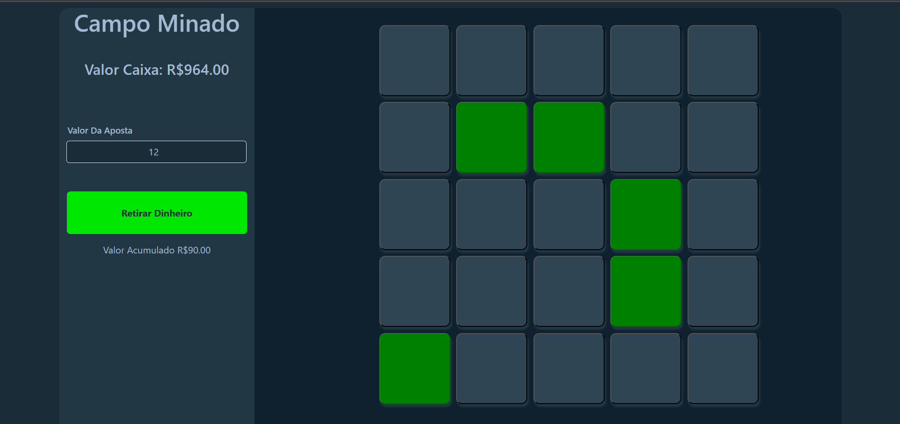

# Campo_Minado_Aposta

Criado usando HTML, css e JavaScript

# OBJETIVO
Criar um campo minado baseado no da Stake onde o objetivo é apostar em onde não esta a bomba

# REGRAS DE FUNCIONAMENTO

 - O apostador seleciona o valor a ser apostado;
 - A cada quadrado que clicar e não tiver uma Bomba o valor da aposta é multiplicado por 1.5;
 - Caso clique na bomba sem retirar o dinheiro antes o valor ganho é 0;

# TELA DO JOGO

